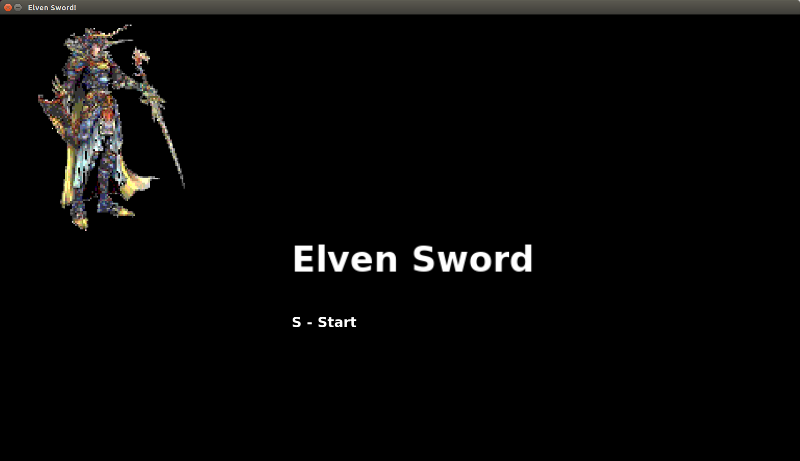
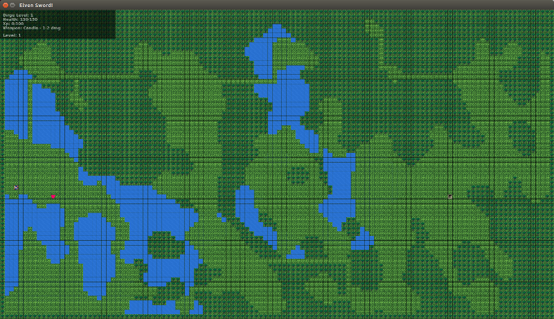
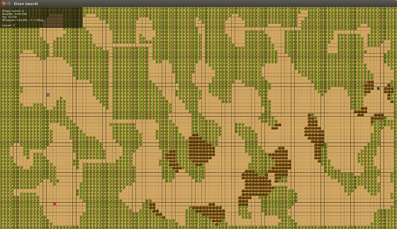
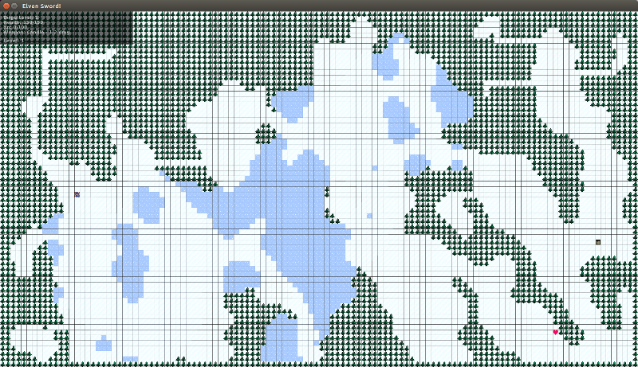
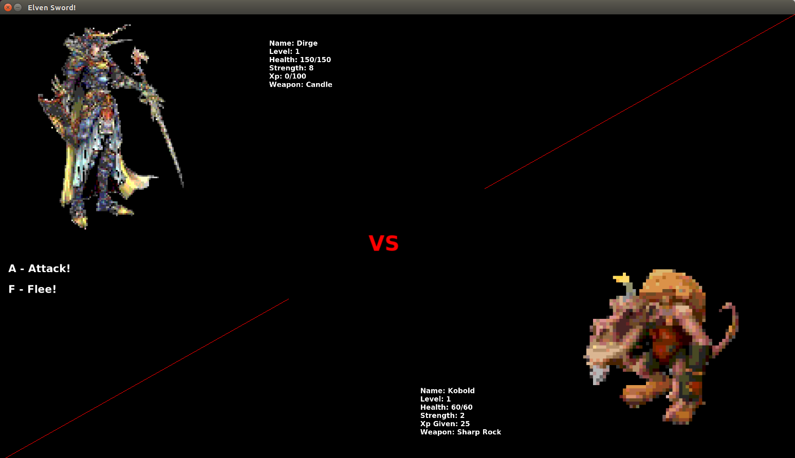

# Elven Sword

Welcome to Elven Sword. Enjoy a simple rpg and fight through procedurally generated levels to face the final boss.

Elven Sword is still in development, and will be seeing frequent updates and added features.


##Requirements:
- Ruby
- Gosu
- Sinatra
- ActiveRecord
- PostgreSQL

##Setup
*Gosu Setup*
- Linux - https://github.com/jlnr/gosu/wiki/Getting-Started-on-Linux
- OS X - https://github.com/jlnr/gosu/wiki/Getting-Started-on-OS-X


```
git clone https://github.com/adammcfadden/elven_sword
cd elven_sword
bundle
#make sure postgres is running
rake db:create
rake db:migrate
ruby run.rb

```

##Screens






##Creators
[Toby](https://github.com/tobyalden)
[Alec](https://github.com/Ginkko)
[Andrew](https://github.com/ampletorque)
[Adam](https://github.com/adammcfadden)


##License
GPL v2

Copyright &copy; Adam McFadden 2015.
